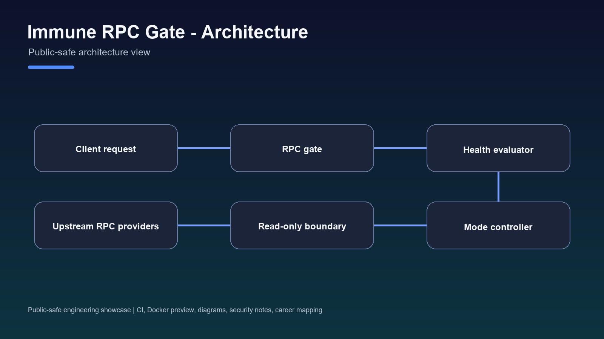
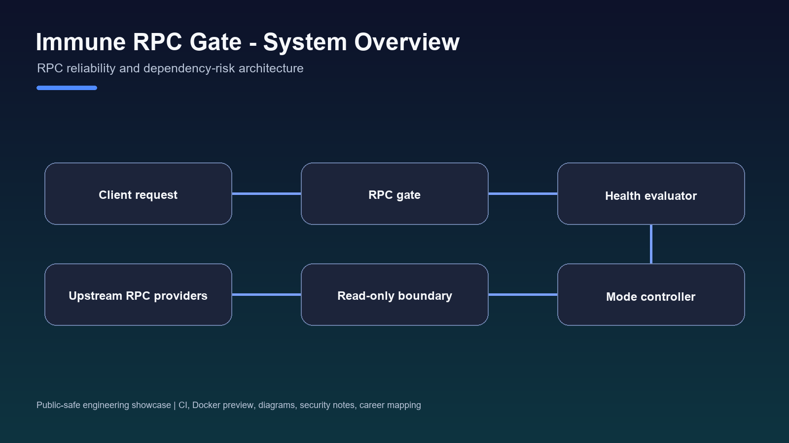
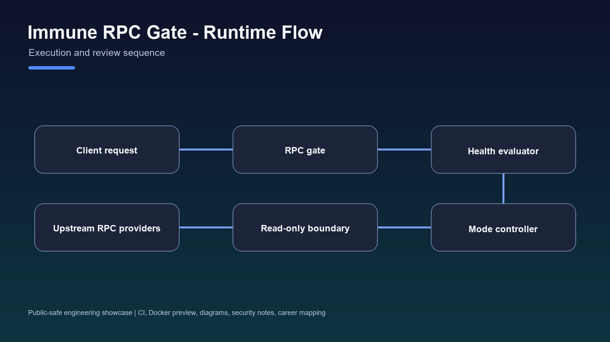
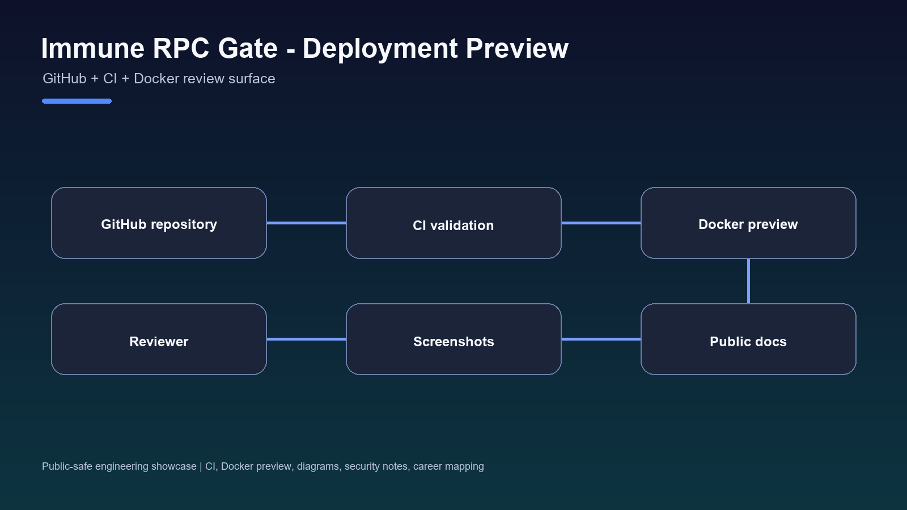

# Immune RPC Gate

[](https://github.com/0xChrisSKR/immune-rpc-gate/actions/workflows/ci.yml)

[](https://github.com/0xChrisSKR)




Immune RPC Gate is a secure RPC gateway and reliability architecture created from practical RPC latency, node synchronization, and front-end/back-end state consistency problems.

I designed it around a simple question: when an RPC dependency becomes slow, inconsistent, or unsafe, what should the product do instead of pretending everything is fine?

## One-line Positioning

Secure RPC gateway architecture for read-only boundaries, health checks, failover, and Normal / Degraded / OFF modes.

## Problem

RPC dependencies can become unstable, slow, unavailable, abusive, or untrusted. When product or AI workflows depend on RPC state, weak boundaries can create state mismatch, failed transactions, unsafe writes, or unclear user feedback.

## My Role

I designed the reliability model, RPC boundary concept, failover behavior, operating modes, and public documentation package.

## What I Designed

- Normal Mode for healthy RPC behavior.
- Degraded Mode for limited operation under elevated risk.
- OFF Mode for disabling unsafe operations.
- Read-only Gate for constrained non-mutating access.
- Health checks and failover logic.
- Explicit 503 behavior when the system cannot process a request safely.
- Threat model for external dependency risk.

## Tech Stack

- RPC gateway architecture
- Infrastructure reliability design
- Health check and failover concepts
- Web3 infrastructure risk modeling
- API boundary design


## Engineering Assets








- CI workflow: [.github/workflows/ci.yml](.github/workflows/ci.yml)
- Deployment preview: [Dockerfile](Dockerfile), [docker-compose.yml](docker-compose.yml), [.env.example](.env.example)
- API examples: [docs/API_EXAMPLES.md](docs/API_EXAMPLES.md)
- Folder structure: [docs/FOLDER_STRUCTURE.md](docs/FOLDER_STRUCTURE.md)
- Engineering notes: [docs/ENGINEERING_NOTES.md](docs/ENGINEERING_NOTES.md)
- Performance notes: [docs/PERFORMANCE.md](docs/PERFORMANCE.md)
- Security notes: [docs/SECURITY.md](docs/SECURITY.md)
- Future work: [docs/FUTURE_WORK.md](docs/FUTURE_WORK.md)
- Career mapping: [docs/CAREER_MAPPING.md](docs/CAREER_MAPPING.md)

## Local Deployment Preview

```bash
cp .env.example .env
docker compose up --build
```

Open `http://localhost:8080` after the container starts. This preview serves the public showcase package only.

The deployment preview is for repository review and portfolio evaluation. It does not expose private infrastructure, secrets, production topology, or private source code.

## Public Artifacts

- Architecture: [docs/ARCHITECTURE.md](docs/ARCHITECTURE.md)
- Public artifacts: [docs/PUBLIC_ARTIFACTS.md](docs/PUBLIC_ARTIFACTS.md)
- Visual artifacts: [docs/SCREENSHOTS.md](docs/SCREENSHOTS.md)
- Lessons learned: [docs/LESSONS_LEARNED.md](docs/LESSONS_LEARNED.md)
- 104 summary: [docs/104_PROJECT_SUMMARY.md](docs/104_PROJECT_SUMMARY.md)
- What this proves: [docs/WHAT_THIS_PROVES.md](docs/WHAT_THIS_PROVES.md)
- What this does not claim: [docs/WHAT_THIS_DOES_NOT_CLAIM.md](docs/WHAT_THIS_DOES_NOT_CLAIM.md)

## Screenshots / Diagrams

- Architecture diagram: `assets/architecture.png`
- Mermaid source: `assets/diagrams/architecture.mmd`

No product UI screenshot is claimed for this repository; it is presented as an architecture showcase.

## Relation to the Portfolio Narrative

Immune RPC Gate connects my C-Chain infrastructure work with later TRACE platform reliability. It shows how I think about external dependency risk, state consistency, and security boundaries before building higher-level AI workflows.

## Portfolio Ecosystem

- WorldPeace DAO: https://github.com/0xChrisSKR/worldpeace-dao-showcase
- C-Chain: https://github.com/0xChrisSKR/cchain-system-showcase
- Immune RPC Gate: this repository
- TRACE ProofFeed: https://github.com/TRACE-CChain-Labs/trace-prooffeed-solana-agent
- TRACE AI Platform: https://github.com/0xChrisSKR/trace-ai-platform-showcase
- GO2 Agent Lab (planned public repository): https://github.com/0xChrisSKR/go2-agent-lab

## What A Reviewer Can Verify

- The operating mode model.
- The architecture diagram and Mermaid source.
- The reliability reasoning in engineering decisions.
- The explicit claim boundary around deployment and patent status.

## Safe Status

This design was evaluated as a potential patent direction. This repository does not claim that a patent was filed or granted.
