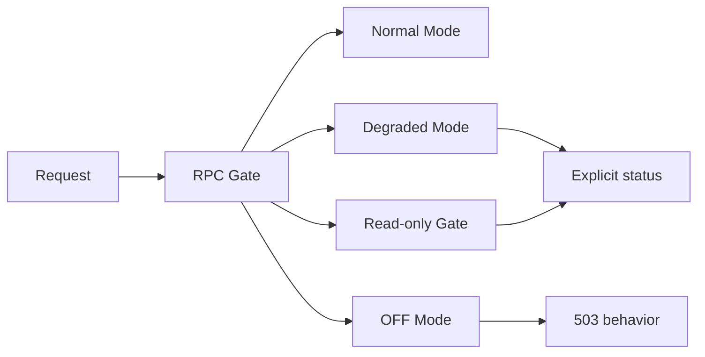

# Architecture

## Mode Design

- Normal Mode: expected read/write behavior when the dependency is healthy.
- Degraded Mode: limited behavior when risk is elevated.
- Read-only Gate: non-mutating requests only.
- OFF Mode: unsafe operations disabled.
- 503 behavior: explicit unavailable/block response when the request cannot be handled safely.
